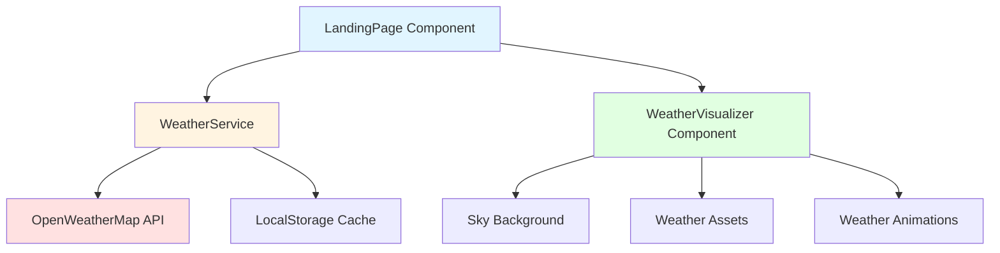

# Design Document: Dynamic Weather Landing Page

## Overview

This feature enhances the existing garden-themed landing page by integrating real-time weather visualization. The system fetches current weather data for Des Moines, IA from the OpenWeatherMap API and dynamically adjusts visual elements (sky color, weather icons, animations) to reflect current conditions.

The design follows a separation of concerns approach with three main layers:
- **Data Layer**: Weather service responsible for API communication and data transformation
- **Presentation Layer**: Weather visualizer component that renders weather-specific UI elements
- **Integration Layer**: Modified LandingPage component that orchestrates weather visualization

The implementation leverages React's component model, TypeScript for type safety, and CSS transitions for smooth visual changes. Weather data is cached for 30 minutes to minimize API calls while maintaining freshness.

## Architecture

### System Components



### Component Responsibilities

**WeatherService**
- Fetches weather data from OpenWeatherMap API
- Manages caching with 30-minute TTL
- Maps API weather codes to six weather categories
- Handles errors with fallback to "sunny" default
- Implements 5-second timeout for API requests

**WeatherVisualizer Component**
- Renders sky background based on weather condition
- Positions and animates weather assets (sun, clouds, rain, snow)
- Manages smooth transitions between weather states
- Maintains responsive layout across viewports
- Integrates with existing LandingPage layout

**LandingPage Component (Modified)**
- Initializes weather data fetch on mount
- Passes weather condition to WeatherVisualizer
- Maintains existing functionality (typewriter, seed stack, progress bar)
- Preserves mobile bypass behavior

### Data Flow

1. LandingPage mounts → WeatherService.fetchWeather() called
2. WeatherService checks cache → if valid, return cached data
3. If cache miss → API request to OpenWeatherMap
4. API response → parse and categorize weather condition
5. Weather data → passed to WeatherVisualizer as prop
6. WeatherVisualizer → renders appropriate visual elements
7. On weather change → smooth transition animations

## Components and Interfaces

### WeatherService

```typescript
interface WeatherData {
  condition: WeatherCondition;
  temperature: number;
  timestamp: number;
  description: string;
}

type WeatherCondition = 'sunny' | 'cloudy' | 'rainy' | 'snowy' | 'foggy' | 'stormy';

interface WeatherCache {
  data: WeatherData;
  expiresAt: number;
}

class WeatherService {
  private static readonly API_KEY = import.meta.env.VITE_WEATHER_API_KEY;
  private static readonly API_URL = 'https://api.openweathermap.org/data/2.5/weather';
  private static readonly LOCATION = 'Des Moines,IA,US';
  private static readonly CACHE_KEY = 'weather_cache';
  private static readonly CACHE_DURATION = 30 * 60 * 1000; // 30 minutes
  private static readonly TIMEOUT = 5000; // 5 seconds

  static async fetchWeather(): Promise<WeatherData>;
  private static getCachedWeather(): WeatherData | null;
  private static setCachedWeather(data: WeatherData): void;
  private static categorizeWeather(apiResponse: any): WeatherCondition;
  private static getDefaultWeather(): WeatherData;
}
```

### WeatherVisualizer Component

```typescript
interface WeatherVisualizerProps {
  condition: WeatherCondition;
  viewportWidth: number;
  viewportHeight: number;
  fadeOut: boolean;
}

interface WeatherAssetConfig {
  type: 'sun' | 'cloud' | 'dark-cloud';
  position: { top: string; left: string };
  opacity?: number;
}

interface AnimationConfig {
  type: 'rain' | 'snow' | 'lightning';
  count?: number;
  speed?: number;
}

const WeatherVisualizer: React.FC<WeatherVisualizerProps> = (props) => {
  // Renders sky background, weather assets, and animations
  // Returns JSX fragment with positioned elements
}
```

### Weather Animation Components

```typescript
// RainAnimation Component
interface RainAnimationProps {
  count: number;
}

// SnowAnimation Component
interface SnowAnimationProps {
  count: number;
}

// LightningEffect Component
interface LightningEffectProps {
  minInterval: number;
  maxInterval: number;
}
```

## Data Models

### OpenWeatherMap API Response

```typescript
interface OpenWeatherAPIResponse {
  weather: Array<{
    id: number;        // Weather condition code
    main: string;      // Group of weather parameters (Rain, Snow, Clear, etc.)
    description: string;
    icon: string;
  }>;
  main: {
    temp: number;      // Temperature in Kelvin
    feels_like: number;
    temp_min: number;
    temp_max: number;
    pressure: number;
    humidity: number;
  };
  visibility: number;  // Visibility in meters
  clouds: {
    all: number;       // Cloudiness percentage
  };
  dt: number;          // Time of data calculation (Unix timestamp)
  name: string;        // City name
}
```

### Weather Condition Mapping

The service maps OpenWeatherMap condition codes to our six categories:

| API Code Range | Main Group | Our Category |
|---------------|------------|--------------|
| 800 | Clear | sunny |
| 801-804 | Clouds (>50%) | cloudy |
| 500-531 | Rain | rainy |
| 600-622 | Snow | snowy |
| 701-781 (visibility <1km) | Atmosphere | foggy |
| 200-232 | Thunderstorm | stormy |

### Visual Configuration by Weather Condition

```typescript
const WEATHER_CONFIGS: Record<WeatherCondition, {
  skyColor: string;
  assets: WeatherAssetConfig[];
  animations: AnimationConfig[];
  sunVisible: boolean;
  sunOpacity: number;
}> = {
  sunny: {
    skyColor: '#87ceeb',
    assets: [],
    animations: [],
    sunVisible: true,
    sunOpacity: 1.0
  },
  cloudy: {
    skyColor: '#b0c4de',
    assets: [
      { type: 'cloud', position: { top: '10vh', left: '20vw' } },
      { type: 'cloud', position: { top: '15vh', left: '50vw' } },
      { type: 'cloud', position: { top: '8vh', left: '75vw' } }
    ],
    animations: [],
    sunVisible: false,
    sunOpacity: 0.3
  },
  rainy: {
    skyColor: '#778899',
    assets: [
      { type: 'cloud', position: { top: '5vh', left: '25vw' } },
      { type: 'cloud', position: { top: '10vh', left: '60vw' } }
    ],
    animations: [{ type: 'rain', count: 50, speed: 1 }],
    sunVisible: false,
    sunOpacity: 0
  },
  snowy: {
    skyColor: '#d3d3d3',
    assets: [
      { type: 'cloud', position: { top: '5vh', left: '30vw' } },
      { type: 'cloud', position: { top: '12vh', left: '65vw' } }
    ],
    animations: [{ type: 'snow', count: 50, speed: 0.5 }],
    sunVisible: false,
    sunOpacity: 0
  },
  foggy: {
    skyColor: '#c0c0c0',
    assets: [],
    animations: [],
    sunVisible: true,
    sunOpacity: 0.5
  },
  stormy: {
    skyColor: '#4a5568',
    assets: [
      { type: 'dark-cloud', position: { top: '5vh', left: '20vw' } },
      { type: 'dark-cloud', position: { top: '10vh', left: '55vw' } }
    ],
    animations: [
      { type: 'rain', count: 50, speed: 1.5 },
      { type: 'lightning', minInterval: 3000, maxInterval: 8000 }
    ],
    sunVisible: false,
    sunOpacity: 0
  }
};
```


## Correctness Properties

A property is a characteristic or behavior that should hold true across all valid executions of a system—essentially, a formal statement about what the system should do. Properties serve as the bridge between human-readable specifications and machine-verifiable correctness guarantees.

### Property Reflection

After analyzing all acceptance criteria, I identified the following redundancies:
- Requirements 11.2, 11.3, and 11.4 all specify returning "sunny" for different error types, which is subsumed by the general error handling property (1.3)
- Multiple requirements test specific weather condition rendering (3.x, 4.x, 5.x, 6.x, 7.x, 8.x), but these are better tested as examples rather than properties since they test specific input-output pairs

The properties below focus on universal behaviors that should hold across all inputs, while specific condition mappings and rendering details are better suited for unit tests.

### Property 1: Error Resilience - Default to Sunny

For any error condition (network failure, timeout, invalid response, missing data), the Weather_Service should return a WeatherData object with condition set to "sunny".

**Validates: Requirements 1.3, 11.2, 11.3, 11.4**

### Property 2: Weather Data Structure Completeness

For any successful weather fetch operation, the returned WeatherData object should contain all required fields: condition (one of six valid types), temperature (number), timestamp (number), and description (string).

**Validates: Requirements 1.4**

### Property 3: Cache Consistency

For any weather data fetch, if a subsequent fetch occurs within 30 minutes, the returned data should be identical to the first fetch without making a new API call.

**Validates: Requirements 1.5**

### Property 4: Weather Categorization Validity

For any API response from OpenWeatherMap, the categorizeWeather function should return exactly one of the six valid WeatherCondition values: 'sunny', 'cloudy', 'rainy', 'snowy', 'foggy', or 'stormy'.

**Validates: Requirements 2.1**

### Property 5: Snow Falls Slower Than Rain

For any viewport configuration, when comparing rain and snow animations, the fall speed of snowflakes should be less than the fall speed of rain droplets.

**Validates: Requirements 6.4**

### Property 6: Lightning Interval Bounds

For any lightning flash in stormy conditions, the interval between consecutive flashes should be between 3000ms and 8000ms (inclusive).

**Validates: Requirements 8.4**

### Property 7: Responsive Asset Scaling

For any viewport dimensions (width, height), weather assets should scale proportionally such that their aspect ratios remain constant and their sizes are calculated as percentages of viewport dimensions.

**Validates: Requirements 10.1**

### Property 8: UI Resilience to Weather Service State

For any weather service state (loading, error, success, or undefined), the LandingPage component should render without throwing errors and display all core UI elements (typewriter text, progress bar, seed stack, soil).

**Validates: Requirements 11.5**

## Error Handling

### Weather Service Error Handling

The WeatherService implements comprehensive error handling to ensure the landing page always displays correctly:

**Network Errors**
- Catch fetch failures (no internet, DNS issues, connection refused)
- Log error to console with descriptive message
- Return default sunny weather data

**Timeout Handling**
- Implement 5-second timeout using AbortController
- Abort request if timeout exceeded
- Return default sunny weather data

**Invalid Response Handling**
- Validate API response structure before parsing
- Check for required fields (weather array, main object, clouds, visibility)
- Handle malformed JSON
- Return default sunny weather data for any validation failure

**API Key Issues**
- Detect 401 Unauthorized responses
- Log warning about missing or invalid API key
- Return default sunny weather data

**Rate Limiting**
- Detect 429 Too Many Requests responses
- Log warning about rate limit
- Return cached data if available, otherwise default sunny weather

### Weather Visualizer Error Handling

**Missing Assets**
- Use CSS fallbacks if image assets fail to load
- Render colored divs as placeholder weather elements
- Log warnings for missing assets

**Invalid Props**
- Validate weather condition prop against known types
- Default to sunny visualization if invalid condition received
- Validate viewport dimensions are positive numbers

**Animation Errors**
- Wrap animation logic in try-catch blocks
- Gracefully degrade to static visuals if animations fail
- Continue rendering other weather elements

### Cache Error Handling

**LocalStorage Unavailable**
- Detect if localStorage is disabled or unavailable
- Fall back to in-memory caching for session duration
- Log warning about cache unavailability

**Corrupted Cache Data**
- Validate cache structure before using
- Clear corrupted cache entries
- Fetch fresh data if cache is invalid

## Testing Strategy

### Dual Testing Approach

This feature requires both unit tests and property-based tests for comprehensive coverage:

**Unit Tests** focus on:
- Specific weather condition mappings (clear → sunny, rain → rainy, etc.)
- Exact visual configurations (sky colors, asset positions)
- Specific error scenarios (network error, timeout, invalid response)
- Component rendering with specific props
- Integration between components
- Edge cases (empty responses, missing fields, extreme values)

**Property-Based Tests** focus on:
- Universal behaviors across all error types
- Data structure completeness across all responses
- Cache consistency across all time intervals
- Weather categorization validity across all API responses
- Animation timing bounds across all random intervals
- Responsive scaling across all viewport dimensions
- UI resilience across all service states

### Testing Tools

**Unit Testing**
- Framework: Vitest (already in project)
- React Testing: @testing-library/react
- Mocking: vi.mock for API calls and localStorage

**Property-Based Testing**
- Library: fast-check (to be added)
- Configuration: Minimum 100 iterations per property test
- Each test tagged with: `Feature: dynamic-weather-landing-page, Property {number}: {property_text}`

### Test Organization

```
src/
  services/
    __tests__/
      WeatherService.test.ts          # Unit tests
      WeatherService.property.test.ts # Property tests
  components/
    weather/
      __tests__/
        WeatherVisualizer.test.tsx          # Unit tests
        WeatherVisualizer.property.test.tsx # Property tests
        RainAnimation.test.tsx
        SnowAnimation.test.tsx
        LightningEffect.test.tsx
  landing_page/
    __tests__/
      LandingPage.integration.test.tsx # Integration tests
```

### Key Test Scenarios

**WeatherService Unit Tests**
- Successful API call returns correct data structure
- Clear weather (code 800) maps to sunny
- Rain weather (codes 500-531) maps to rainy
- Snow weather (codes 600-622) maps to snowy
- Clouds >50% (codes 801-804) maps to cloudy
- Low visibility <1km maps to foggy
- Thunderstorm (codes 200-232) maps to stormy
- Network error returns default sunny
- Timeout returns default sunny
- Invalid response returns default sunny
- Cache hit within 30 minutes returns cached data
- Cache miss after 30 minutes fetches new data

**WeatherVisualizer Unit Tests**
- Sunny condition renders #87ceeb background
- Sunny condition displays sun at top-left
- Cloudy condition renders #b0c4de background
- Cloudy condition displays 3+ clouds
- Rainy condition renders #778899 background
- Rainy condition displays rain animation with 50+ droplets
- Snowy condition renders #d3d3d3 background
- Snowy condition displays snow animation
- Foggy condition renders #c0c0c0 background with overlay
- Stormy condition renders #4a5568 background
- Stormy condition displays dark clouds and rain
- Weather transitions animate over correct durations
- Mobile viewport (<768px) bypasses weather visualization

**Property-Based Tests**
- Property 1: Error resilience (generate random error types)
- Property 2: Data structure completeness (generate random API responses)
- Property 3: Cache consistency (generate random timestamps)
- Property 4: Categorization validity (generate random weather codes)
- Property 5: Snow vs rain speed (generate random viewport sizes)
- Property 6: Lightning intervals (generate random flash sequences)
- Property 7: Responsive scaling (generate random viewport dimensions)
- Property 8: UI resilience (generate random service states)

### Test Data Generators (for Property Tests)

```typescript
// Generator for random weather API responses
const arbitraryWeatherResponse = fc.record({
  weather: fc.array(fc.record({
    id: fc.integer({ min: 200, max: 804 }),
    main: fc.constantFrom('Clear', 'Clouds', 'Rain', 'Snow', 'Thunderstorm', 'Atmosphere'),
    description: fc.string(),
    icon: fc.string()
  }), { minLength: 1 }),
  main: fc.record({
    temp: fc.float({ min: 200, max: 330 }),
    pressure: fc.integer({ min: 900, max: 1100 }),
    humidity: fc.integer({ min: 0, max: 100 })
  }),
  visibility: fc.integer({ min: 0, max: 10000 }),
  clouds: fc.record({
    all: fc.integer({ min: 0, max: 100 })
  }),
  dt: fc.integer({ min: 1000000000, max: 2000000000 }),
  name: fc.constant('Des Moines')
});

// Generator for random error types
const arbitraryError = fc.oneof(
  fc.constant(new Error('Network error')),
  fc.constant(new Error('Timeout')),
  fc.constant(new Error('Invalid response')),
  fc.constant({ status: 401, message: 'Unauthorized' }),
  fc.constant({ status: 429, message: 'Too many requests' })
);

// Generator for random viewport dimensions
const arbitraryViewport = fc.record({
  width: fc.integer({ min: 320, max: 3840 }),
  height: fc.integer({ min: 568, max: 2160 })
});

// Generator for random weather conditions
const arbitraryWeatherCondition = fc.constantFrom(
  'sunny', 'cloudy', 'rainy', 'snowy', 'foggy', 'stormy'
);
```

### Coverage Goals

- Line coverage: >90% for WeatherService and WeatherVisualizer
- Branch coverage: >85% for all error handling paths
- Property test iterations: 100 per property
- Integration test coverage: All component interactions
- Visual regression: Manual testing for all 6 weather conditions

### Manual Testing Checklist

- [ ] Verify all 6 weather conditions render correctly
- [ ] Test smooth transitions between all condition pairs
- [ ] Verify animations are smooth at 60fps
- [ ] Test on mobile devices (should bypass landing page)
- [ ] Test on various desktop resolutions (1920x1080, 2560x1440, 3840x2160)
- [ ] Verify with real API key and live weather data
- [ ] Test with API key missing (should default to sunny)
- [ ] Test with network disconnected (should default to sunny)
- [ ] Verify cache works (check network tab for single request)
- [ ] Test cache expiration after 30 minutes
- [ ] Verify existing landing page functionality unchanged
- [ ] Test fadeOut transition to portfolio still works
